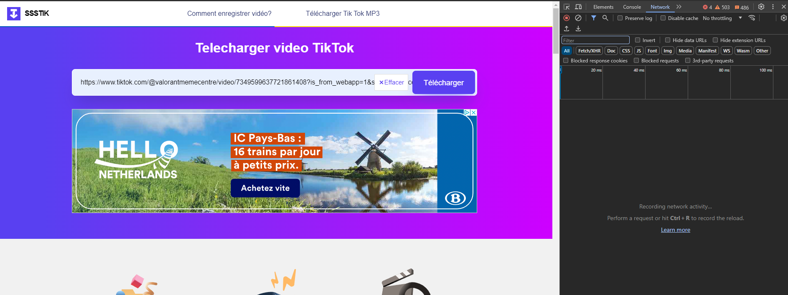
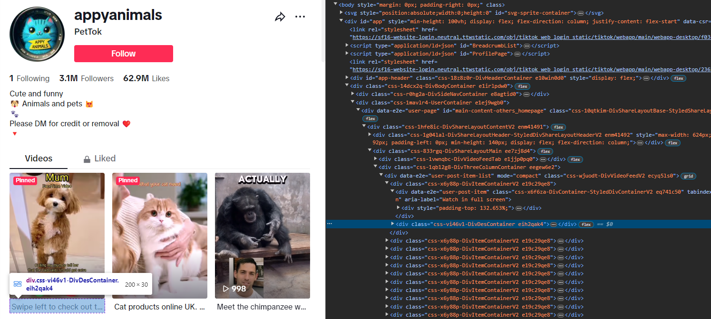

# TikTok Video Downloader

A Python module for automatically downloading TikTok videos.

## Instructions for Usage

### Step 1: Obtain Download Link

1. Go to [ssstik.io](https://ssstik.io/) and input any TikTok link.
2. Before clicking on Download, right-click on the page and select "Inspect".
3. In the Developer Tools panel, navigate to the "Network" tab.
4. Click on the Download button on the website.
5. Look for a request with `abc?url=dl` in the Network tab.
6. Right-click on this request and choose "Copy" > "Copy as cURL (bash)".

### Step 2: Convert cURL to Python

1. Go to [curlconverter.com](https://curlconverter.com/).
2. Paste the copied cURL command into the text box.
3. Click "Convert to Python".
4. Copy the generated Python code.

### Step 3: Paste Python Code

1. Paste the copied Python code into the `downloadVideo` method in your Python script.
2. Replace the TikTok channel URL placeholder with the actual URL of the TikTok channel you want to extract videos from.
3. Inspect the TikTok page and locate the class name of the video container. You can find it by right-clicking on the video and selecting "Inspect". Look for a div with a class name similar to `
`. Copy this class name and replace the `className` value in your Python code.

### Step 4: Download Videos

1. Run your Python script.
2. The videos from the specified TikTok channel should be downloaded to your local directory.

## Example

- To locate the network tab in the browser's developer tools:
  

- To find the class name of the video container on the TikTok page:
  

## Dependencies

- [requests](https://pypi.org/project/requests/): HTTP library for making requests and handling responses.

## Contribution

Contributions are welcome! If you find any bugs or want to suggest enhancements, please open an issue or submit a pull request.

## License

This project is licensed under the MIT License - see the [LICENSE](LICENSE) file for details.